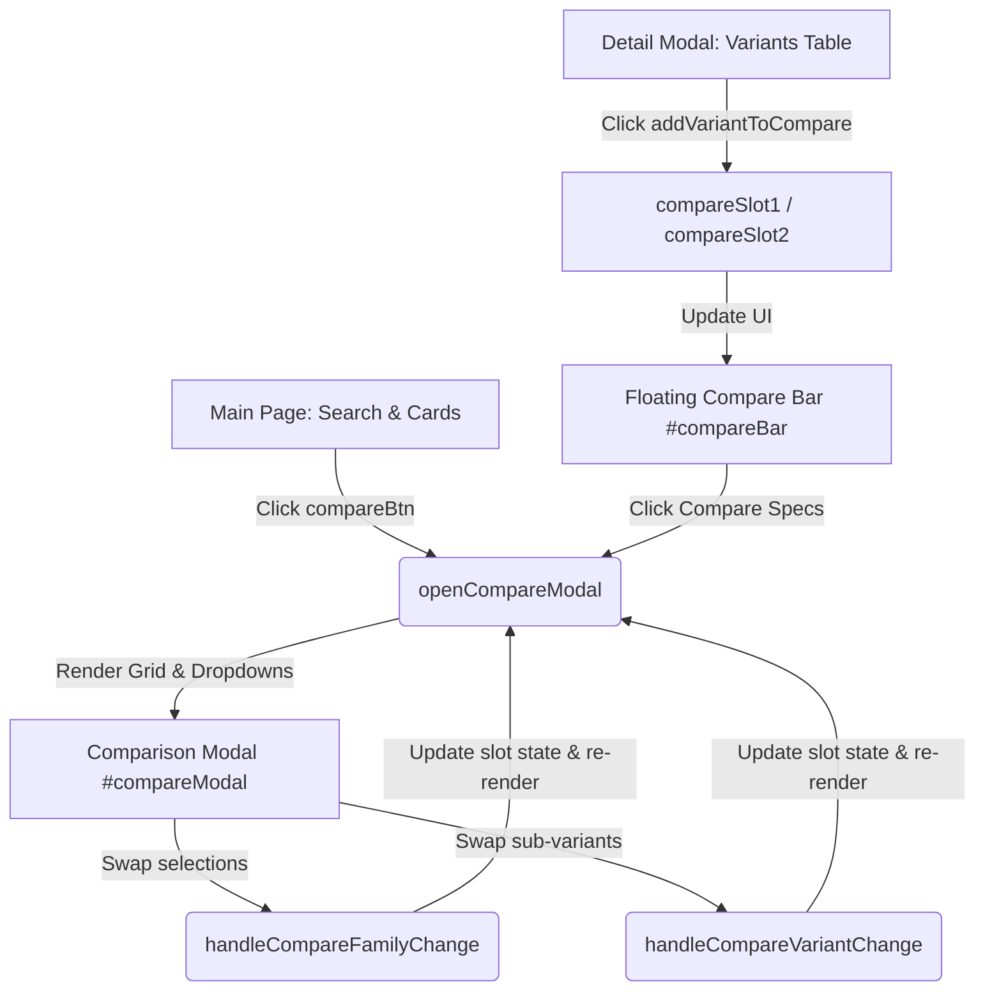

# Technical Reference: AeroType Aircraft & Comparison System Updates

This document serves as a technical design and architectural reference for AI agents working on the **AeroType** application. It details the database modifications, UI component integrations, and the side-by-side comparison system.

---

## 1. Database Architecture Updates (`data/aircrafts.js`)

The dataset is exposed globally as `window.aircraftData` (loaded as `allAircraftData` inside `script.js`). 

### Key Architectural Guidelines Applied:
1.  **Maximum Seating Alignment**: All narrow-body (single-aisle) aircraft seating configurations are aligned to their **maximum exit limit / seating capacity** rather than typical configurations.
2.  **Top-Level Card Alignment**: Properties of a family group card (`isGroup: true`) are set to match the specs of the **largest/longest variant** in that group (e.g., the A320 Family card reflects the A321XLR specs; the B737 MAX card reflects the MAX 10).
3.  **Engine Options Field**: Added `engineOptions` (Array of Strings) to all aircraft structures and variants.

### Added Aircraft Families:
*   **Airbus Concorde** (`concorde`): Supersonic narrow-body. Seats: 128, Range: 7,222km, Engines: 4.
*   **Lockheed Martin L-1011 TriStar** (`l1011-tristar`): Wide-body tri-jet. Seats: 330, Range: 9,630km, Engines: 3. Variants: L1011-1, L1011-100, L1011-200, L1011-300, L1011-500.
*   **Douglas DC-10 Family** (`dc-10-family`): Wide-body tri-jet. Seats: 380, Range: 9,600km, Engines: 3. Variants: DC-10-10, DC-10-30.
*   **Douglas DC-8 Family** (`dc-8-family`): Classic narrow-body quad-jet. Seats: 259, Range: 8,500km, Engines: 4. Features 11 detailed variants (DC-8-11 through DC-8-73).
*   **Douglas DC-9 Family** (`dc-9-family`): Rear-engine narrow-body twin-jet. Seats: 135, Range: 3,300km, Engines: 2. Features 7 variants (DC-9-11 through DC-9-51).
*   **COMAC C909** (`c909-family`): Regional jet. Seats: 97, Range: 3,700km, Engines: 2. Variants: C909-700, C909-700ER.
*   **COMAC C919** (`c919`): Narrow-body twin-jet. Seats: 192, Range: 5,555km, Engines: 2.
*   **Fokker 70 / 100** (`fokker-100`): Regional jet. Seats: 122, Range: 4,300km, Engines: 2. Variants: Fokker 70, Fokker 100.

### Major Model Splits:
*   **MD-80 Series** (`md-80-family`) and **MD-90** (`md-90`) are split into distinct cards to represent their structural differences. MD-90 references a new local photo asset `images/md-90.jpg` with updated acoustics and engine features.

---

## 2. UI Implementations & Engine Options Integration

### Detail Modal Layout Grid:
The detail modal (`#detailModal`) layout has been widened to `800px` to house detailed tables without line wrapping. The basic specifications grid is refactored into a **4-grid item**, where the fourth item represents **엔진 옵션 (Engine Options)**.

### Engine Display inside Variants Table:
Within the sub-variants table, a new column displaying specific engine options (e.g., `CFM LEAP-1A, PW1100G`) is injected dynamically for each variant.

---

## 3. The Sub-variant Comparison System (1:1 맞비교)

This feature enables users to dynamically cross-reference any two specific sub-variants (or single-variant families) side-by-side.

### Component Map & Data flow:

### State Variables:
*   `compareSlot1` & `compareSlot2` (Object | null): Stores `{ aircraftId, variantId, name }` payloads.

### DOM Node References:
1.  `#compareBar` (div): Fixed bottom floating bar with slots and action button. Slide-up animation controlled via the `.active` CSS class.
2.  `#compareSlot1` / `#compareSlot2` (div): Renders active model names with `&times;` deletion triggers.
3.  `#compareBtn` (button): Triggers the comparison modal. Disabled until both slots are occupied.
4.  `#compareModal` (div): Overlay containing the side-by-side layout.
5.  `#compareDashboard` (div): Dynamic container where the 1:1 specifications grid is generated.
6.  `#mainCompareBtn` (button): Button on the landing page next to the search bar. Instantly launches the comparison modal, auto-populating empty slots with default models (A220-100 & A300-600R) so the user can start comparing right away.

### Core Controller Functions:
*   `addVariantToCompare(aircraftId, variantId)`: Appends an aircraft type or variant to the empty slots.
*   `removeVariantFromCompare(slotIndex)`: Deletes selected entries and re-indexes remaining items.
*   `updateCompareBar()`: Refreshes labels inside `#compareBar` and manages `.active` class toggle.
*   `openCompareModal()`: Launches `#compareModal`. If opened empty (via `#mainCompareBtn`), it auto-populates slots with baseline entries.
*   `renderCompareDashboard()`: Assembles the comparison layout. Toggles dynamic CSS classes (`better`) for specifications matching superior ranges or capacities.
*   `createCompareSelectorHTML(slotIndex, aircraftId, variantId)`: Renders twin nested HTML `<select>` elements.
*   `handleCompareFamilyChange(slotIndex, newAircraftId)`: Handles switching model families inside the modal, resetting the variant selection.
*   `handleCompareVariantChange(slotIndex, aircraftId, newVariantId)`: Handles variant switching within the selected family inside the modal.

### CSS Styling & Grid Structure:
*   `.compare-grid` uses CSS Grid layout: `grid-template-columns: 1.2fr 2fr 2fr` with `gap: 0` to form a unified dashboard table card.
*   `.compare-cell.compare-label`: Dedicated styling to represent specification names (resolves class name conflicts with the global header style).
*   `.compare-gauge-bar`: Visual visualizer for seats and range comparison, automatically highlighting the superior specification using the `.better` modifier.
*   **Responsive Stack Styling**: Mobile layout collapses the comparison table columns (`grid-template-columns: 1fr`) and sets the header labels above slot contents vertically.
